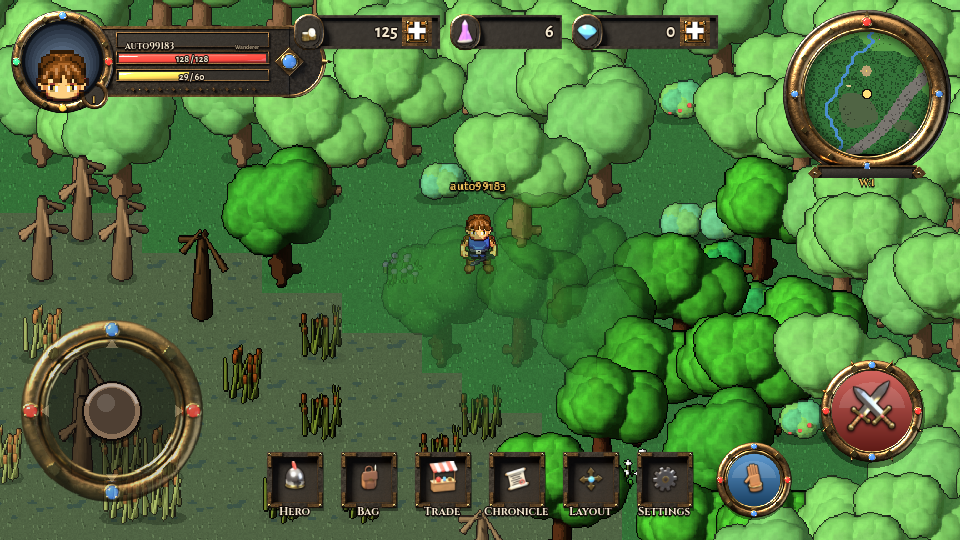
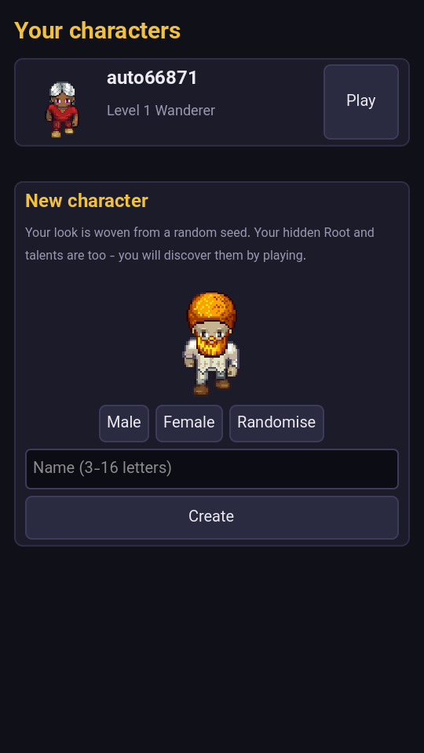
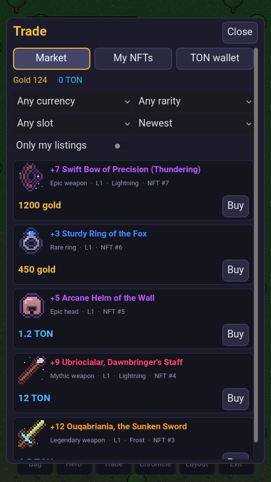
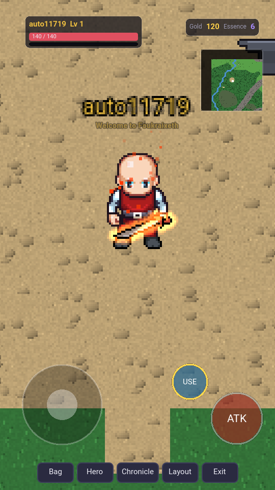

# OMMRPG

یک بازی جهان‌باز پیکسلی که **جهانش را خودش می‌سازد**: زمین، بیوم‌ها، هیولاها، نام‌ها، سیاه‌چال‌ها، آیتم‌ها و ظاهر کاراکترها همه از یک **seed** ساخته می‌شوند. بک‌اند با **Go** (میکروسرویس)، کلاینت با **Godot 4**، و بازی به صورت **تمام‌صفحه داخل تلگرام** (Mini App / وب‌اپ) اجرا می‌شود.

<p>



</p>

## چه چیزهایی آماده است

* **جهان با seed**: فقط seed ذخیره می‌شود؛ بیوم‌ها (دریا، ساحل، دشت، جنگل، بیابان، تندرا، مرداب، کوهستان، تایگا، آتشفشانی)، درخت و صخره، میدان شروع، ورودی سیاه‌چال‌ها و سطح خطر (هرچه از مرکز دورتر، سخت‌تر).
* **هیولاها**: هر جهان ۴۴ گونه‌ی مخصوص خودش را می‌سازد (نام، رنگ، آمار، زیستگاه، اسپرایت پیکسلی).
* **کاراکترها**: ظاهر LPC از روی seed ساخته می‌شود (دکمه‌ی «Randomise»)، به‌همراه Root و Talent **پنهان** که روی رشد اثر دارند؛ کلاس در لول ۱۰ از روی رفتار بازیکن «بیدار» می‌شود.
* **آیتم‌ها**: ۲۴ نوع پایه، ۶ سطح کمیابی تا Mythic، affixهای تصادفی، نام‌های افسانه‌ای؛ آیتم‌ها با استفاده **لول‌آپ** می‌شوند و با طلا و Essence **آپگرید (+N)** می‌شوند (احتمال موفقیت، لاگ و لجر حسابرسی‌پذیر)، و قابل Salvage هستند. تجهیزات پوشیده‌شده روی ظاهر کاراکتر دیده می‌شوند.
* **سیاه‌چال‌ها**: چندطبقه، اتاق و راهرو، صندوق، باس، خروج فقط به همان ورودی.
* **مبارزه‌ی سمت سرور**: برد، کول‌داون، کریتیکال، ضدحمله، مرگ و Respawn.
* **تاریخ جهان**: رویدادها و «اولین‌های جهان» (اولین لجندری، اولین پاک‌کردن هر سیاه‌چال و ...).
* **سرویس اسپرایت** شبیه [Universal LPC Spritesheet Character Generator](https://github.com/liberatedpixelcup/Universal-LPC-Spritesheet-Character-Generator): ترکیب لایه‌ها و ریکالر پالت با ۶۴۶ قطعه‌ی LPC (از OpenGameArt)، به‌علاوه‌ی ساخت پروسیجرال هیولا، آیکون آیتم و تایل‌ست.
* **کلاینت Godot**: تمام‌صفحه در تلگرام، واکنش‌گرا برای گوشی (عمودی و افقی، Safe Area)، جوی‌استیک لمسی چندانگشتی، ضربه‌زدن برای حرکت (مسیریابی)، و **ویرایشگر چیدمان HUD**: جای نوار جان و لول، کیف پول، مینی‌مپ، دکمه‌ها و جوی‌استیک را بکشید، بزرگ یا کوچک یا مخفی کنید؛ چیدمان برای هر جهت صفحه جدا و روی حساب ذخیره می‌شود.

* **مبارزه‌ی عنصری و افکت سلاح**: آتش، یخ، صاعقه، سم، مقدس و سایه با مقاومت متفاوت هر خانواده‌ی هیولا؛ سلاح‌های ارتقایافته (+۵، +۱۰، +۱۵) و عنصری روی کاراکتر **می‌درخشند** و ذره پخش می‌کنند ([WEAPON_FX.md](docs/WEAPON_FX.md)).
* **NFT روی شبکه‌ی خود بازی (OMM Chain)**: آیتم‌های Rare به بالا NFT می‌شوند؛ بلاک‌ها امضای ed25519 دارند و هر تراکنش **اثبات Merkle** دارد.
* **بازار**: خرید و فروش NFTها با **TON** (پول واقعی) یا **طلا** (ارز بازی)؛ اینکه کدام کمیابی با کدام ارز معامله شود را مدیر تعیین می‌کند. کیف پول TON امانی با واریز با memo و برداشت با تأیید مدیر ([ECONOMY.md](docs/ECONOMY.md)).
* **پنل مدیریت ریل‌تایم**: داشبورد زنده، رویدادهای لحظه‌ای، مدیریت بازیکن (اعطا، مسدودسازی، قطع اتصال)، بررسی برداشت‌ها، سیاست بازار، مرورگر زنجیره، گزارش ممیزی و نقش‌ها ([ADMIN.md](docs/ADMIN.md)).
* **الگوریتم‌ها**: همه‌ی وضعیت داغ با **اسکریپت‌های Lua اتمیک** روی Dragonfly (GCRA، سطل توکن حرکت، مرگ دقیقاً یک‌بار با جدول تهدید، بازیابی تنبل)، رودخانه با Priority-Flood، A* با صاف‌کردن مسیر و درون‌یابی بازیکن‌ها ([ALGORITHMS.md](docs/ALGORITHMS.md)).


<p>


</p>

## تکنولوژی‌ها

| بخش | ابزار |
|---|---|
| سرویس‌ها | Go: gateway, identity, character, world, item, presence, combat, dungeon, history, sprite, asset, ton, admin |
| ارتباط سرویس‌ها | NATS (request/reply) + JetStream (رویدادها) |
| ریل‌تایم | Centrifugo v6 (WebSocket، RPC proxy، کانال‌های ناحیه‌ای) |
| داده | PostgreSQL (هر سرویس دیتابیس خودش)، Dragonfly (وضعیت داغ با اسکریپت‌های Lua)، MongoDB (تاریخچه) |
| بلاک‌چین | OMM Chain (داخلی، ed25519 + Merkle)، TON (tonutils-go) |
| کلاینت | Godot 4.4، خروجی Web، Telegram Mini App |

## اجرا

```bash
cd deploy
cp .env.example .env   # TELEGRAM_BOT_TOKEN و رمزها را تنظیم کنید
godot --headless --path ../client --export-release "Web" ../client/build/web/index.html
docker compose up -d --build
# http://localhost:8088  (برای تلگرام پشت HTTPS قرار دهید و آدرس را در BotFather به‌عنوان Mini App ثبت کنید)
# پنل مدیریت: http://localhost:8088/admin/
```

برای توسعه‌ی محلی بدون Docker: [docs/DEVELOPMENT.md](docs/DEVELOPMENT.md).

## مستندات

* [ARCHITECTURE.md](docs/ARCHITECTURE.md): سرویس‌ها، NATS، رویدادها، مالکیت داده، امنیت
* [PROCEDURAL_GENERATION.md](docs/PROCEDURAL_GENERATION.md): سیستم seed و همه‌ی مولدها
* [SPRITE_SERVICE.md](docs/SPRITE_SERVICE.md): سرویس ساخت اسپرایت (LPC + پروسیجرال)
* [GAMEPLAY.md](docs/GAMEPLAY.md): قواعد و اعداد فعلی بازی
* [ALGORITHMS.md](docs/ALGORITHMS.md): اسکریپت‌های Lua روی Dragonfly و الگوریتم‌ها
* [WEAPON_FX.md](docs/WEAPON_FX.md): عنصرها و افکت سلاح‌ها
* [ECONOMY.md](docs/ECONOMY.md): NFT، زنجیره‌ی OMM، بازار، TON و ملاحظات حقوقی
* [ADMIN.md](docs/ADMIN.md): پنل مدیریت ریل‌تایم
* [CLIENT.md](docs/CLIENT.md): کلاینت Godot، تلگرام، HUD قابل‌تنظیم، تست
* [ASSETS.md](docs/ASSETS.md): منابع OpenGameArt و لایسنس‌ها
* [ROADMAP.md](docs/ROADMAP.md): گام‌های بعدی
* [docs/design](docs/design): سند طراحی بازی (بخش‌های مربوط به ربات تلگرام حذف شده است)

## English summary

OMMRPG is a seed-generated pixel-art open world. Go microservices
(NATS, Centrifugo, PostgreSQL, Dragonfly, MongoDB) run the game; a Godot 4
web client plays full-screen inside Telegram as a Mini App, with a
responsive, player-customisable HUD. Worlds, species, dungeons, items
(with item leveling and +N enhancement) and LPC character looks are all
derived from seeds. Hot state runs as atomic Lua scripts on Dragonfly.
Weapons carry elements and visible glow effects. Rare items can be minted
as NFTs on the game's own signed ledger (OMM Chain) and traded for TON or
gold, and a realtime Persian admin panel runs operations. See the docs
above.

## Credits

Character art: Liberated Pixel Cup contributors, via OpenGameArt.org and the
Universal LPC Spritesheet Character Generator. Per-item credits are in
`assets/lpc/catalog.json` and at `/api/v1/sprites/credits`. You **must** show
them in-game (see [ASSETS.md](docs/ASSETS.md)). Font: Vazirmatn (OFL).
