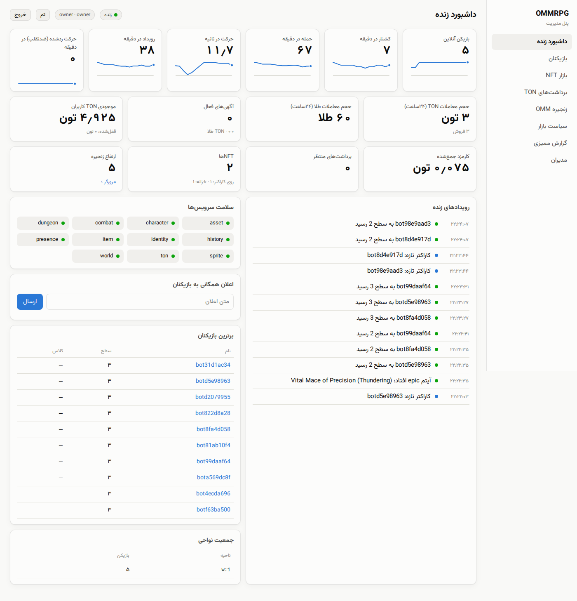
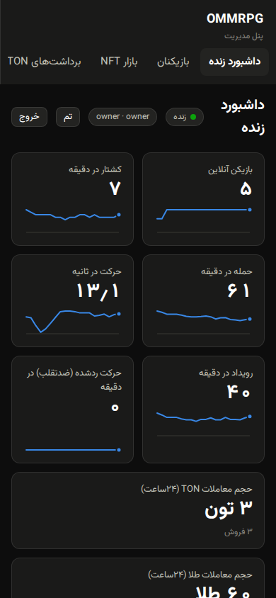
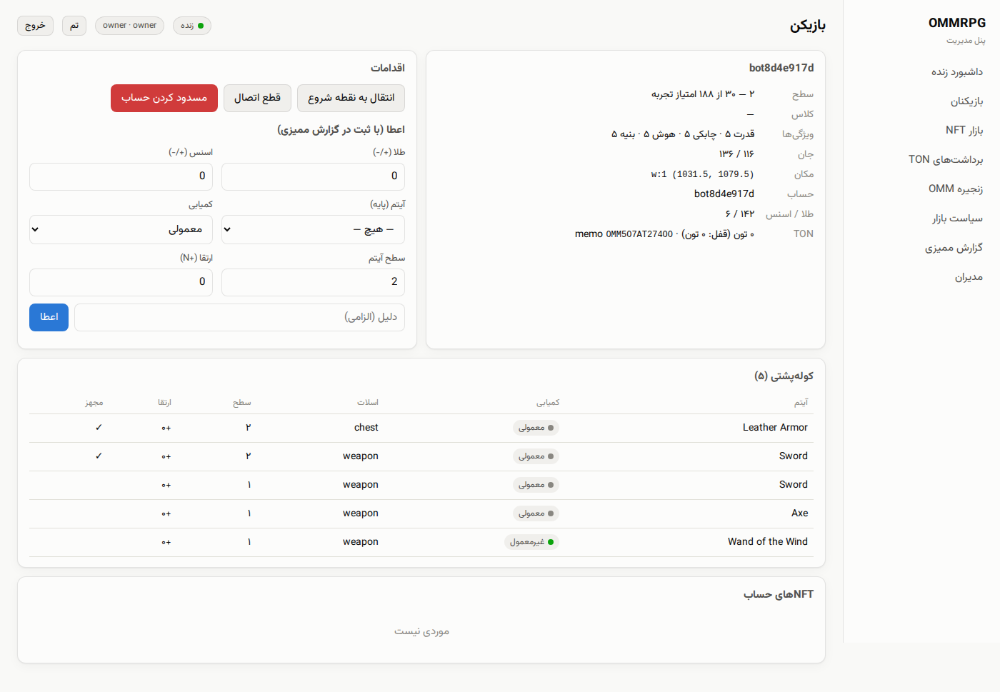

# پنل مدیریت (ریل‌تایم)

سرویس `admin` یک پنل وب فارسی (راست‌به‌چپ، تم روشن و تیره، سازگار با
موبایل) را از داخل باینری خودش سرو می‌کند (`go:embed`). آدرس: `/admin/`
(در docker-compose از طریق nginx، و در اجرای محلی `http://localhost:8095/admin/`).

## ریل‌تایم

پنل بعد از ورود یک توکن Centrifugo می‌گیرد که **سمت سرور** روی دو کانال
`admin:feed` و `admin:metrics` مشترک شده است (namespace `admin` اجازه‌ی
اشتراک از سمت کلاینت نمی‌دهد، پس بازیکن‌ها نمی‌توانند به آن گوش دهند).

* **admin:metrics** هر ۲ ثانیه: بازیکن‌های آنلاین و جمعیت هر ناحیه، کشتار،
  حمله، حرکت و حرکت‌های ردشده‌ی ضدتقلب (از شمارنده‌های پنجره‌ی لغزان در
  Dragonfly)، آمار بازار و TON، و سلامت همه‌ی سرویس‌ها (پینگ از طریق NATS).
  داشبورد برای هر عدد یک نمودار کوچک ۱۰ دقیقه‌ی اخیر با خط راهنما و
  tooltip نشان می‌دهد.
* **admin:feed**: همه‌ی رویدادهای بازی از JetStream (کاراکتر جدید، لول‌آپ،
  کشتن باس، ساخت و فروش NFT، واریز و برداشت TON، ...) با متن فارسی، و
  همچنین هر اقدام مدیرها.

## صفحه‌ها

| صفحه | امکانات |
|---|---|
| داشبورد زنده | شاخص‌ها، اقتصاد، سلامت سرویس‌ها، رویدادهای زنده، برترین بازیکن‌ها، **اعلان همگانی** (در بازی برای همه نمایش داده می‌شود) |
| بازیکنان | جستجو با نام یا شناسه؛ جزئیات: آمار، جان، مکان، کیف، NFTها، موجودی TON؛ **اعطای** طلا، Essence یا آیتم (با کمیابی، سطح و ارتقای دلخواه، با دلیل اجباری)؛ **انتقال به نقطه‌ی شروع**، **قطع اتصال**، **مسدودکردن حساب** |
| بازار NFT | آگهی‌ها بر اساس وضعیت؛ لغو آگهی مشکوک؛ تاریخچه‌ی کامل هر NFT |
| برداشت‌های TON | صف بررسی؛ تأیید یا رد (با بازگشت وجه)؛ واریز آزمایشی در حالت mock |
| زنجیره‌ی OMM | ارتفاع، کلید عمومی، بلاک‌ها و تراکنش‌ها، **بررسی اثبات Merkle** یک تراکنش |
| سیاست بازار | کمیابی لازم برای NFT و فروش با طلا یا TON، کارمزد، کف قیمت، حداقل و کارمزد برداشت، سقف تأیید خودکار، کلیدهای قطع اضطراری |
| گزارش ممیزی | همه‌ی اقدام‌ها با مدیر، هدف، جزئیات و نتیجه |
| مدیران | افزودن، تغییر نقش، غیرفعال‌کردن |

## نقش‌ها

| اقدام | viewer | moderator | admin | owner |
|---|---|---|---|---|
| دیدن همه‌چیز (به‌جز ممیزی و مدیران) | ✓ | ✓ | ✓ | ✓ |
| قطع اتصال، انتقال، مسدودسازی، لغو آگهی، اعلان | | ✓ | ✓ | ✓ |
| اعطای آیتم و طلا، بررسی برداشت، تغییر سیاست، گزارش ممیزی | | | ✓ | ✓ |
| مدیریت مدیرها | | | | ✓ |

## امنیت

* رمزها با **bcrypt**؛ توکن مدیر با کلید جدای `ADMIN_SECRET` امضا می‌شود
  (توکن بازیکن هرگز در پنل معتبر نیست) و نقش در هر درخواست دوباره از
  دیتابیس خوانده می‌شود، پس غیرفعال‌کردن یک مدیر فوری اثر می‌کند.
* ورود با **GCRA** محدود شده است (۵ تلاش در دقیقه برای هر IP و هر نام
  کاربری). IP از هدر `X-Real-IP` خوانده می‌شود که nginx خودش می‌نویسد.
* **مسدودسازی** در Dragonfly هم ثبت می‌شود؛ gateway در هر درخواست REST و
  RPC آن را چک می‌کند و اتصال WebSocket بازیکن هم قطع می‌شود.
* هر اقدام تغییردهنده در `audit_log` ثبت و آنی در فید زنده نشان داده
  می‌شود.
* در اولین اجرا مدیر `ADMIN_BOOTSTRAP_USER` ساخته می‌شود. اگر
  `ADMIN_BOOTSTRAP_PASSWORD` خالی باشد، یک رمز تصادفی یک‌بار در لاگ سرویس
  چاپ می‌شود.
* در محیط واقعی دسترسی به `/admin/` را محدودتر هم کنید (VPN، لیست IP یا
  احراز هویت پایه‌ی nginx).
