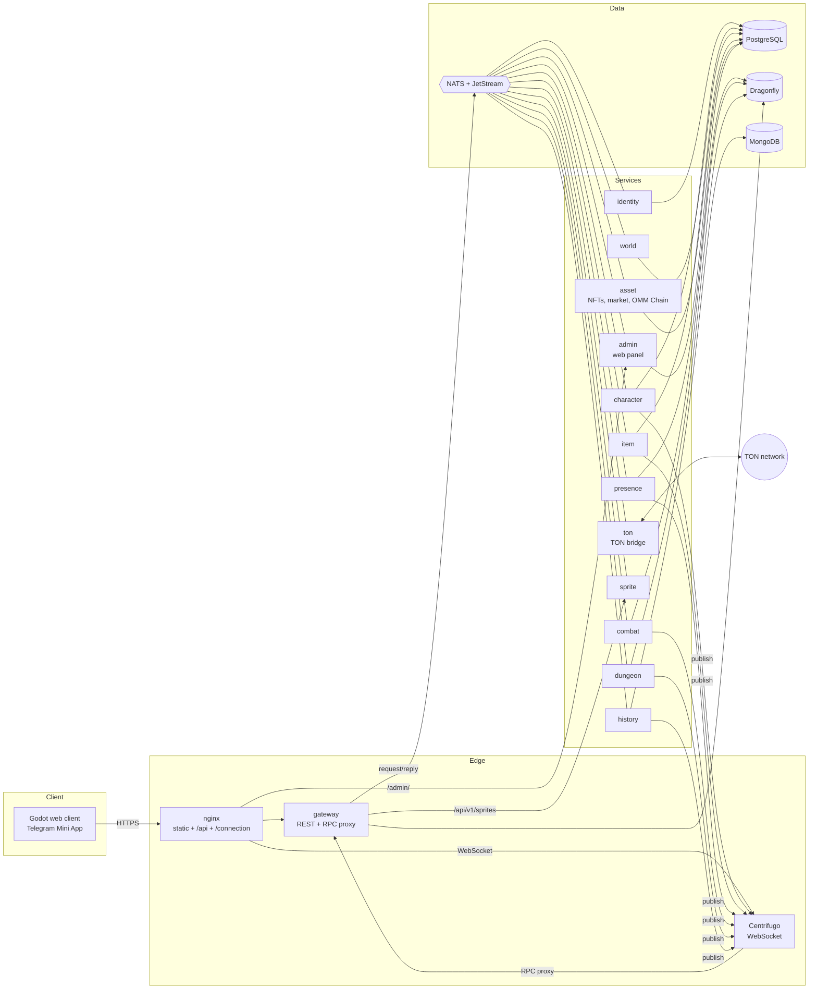

# Architecture

The backend is a set of small Go services that talk over **NATS**. Players
reach it through one public **gateway** (REST) and **Centrifugo**
(WebSocket). State is split between **PostgreSQL** (authoritative,
transactional), **Dragonfly** (hot, temporary) and **MongoDB** (history
documents). The client is **Godot 4**, exported to the web and opened
full-screen inside Telegram as a Mini App.



## Request paths

* **REST** (`/api/v1/...`): login, characters, inventory, settings, world
  chunks, history. The gateway authenticates the bearer session token and
  forwards to the owning service over NATS request/reply.
* **Realtime RPC**: the client sends `move`, `attack`, `interact`, `monsters`,
  `nearby`, `vitals`, `dungeon` as Centrifugo RPCs on its single WebSocket.
  Centrifugo calls the gateway's `/centrifugo/rpc` proxy (protected by a
  shared header secret) with the authenticated user id, which is the
  character id from the connection JWT. The gateway dispatches to the
  services over NATS.
* **Push**: services publish to Centrifugo through its HTTP API:
  * `area:w<world>_<cx>_<cy>`: movement, monster hits/deaths in one
    32x32-tile chunk; clients subscribe to the 3x3 chunks around them.
  * `dungeon:<instance>_<floor>`: the same inside a dungeon floor.
  * `personal:<character>`: loot, XP, level-ups, teleports, death (a
    server-side subscription inside the connection token).
  * `personal:<character>` also carries TON deposits/withdrawals and
    "your item sold" notices.
  * `news:world`: world-firsts and admin announcements for everyone.
  * `admin:feed`, `admin:metrics`: the admin panel only (server-side
    subscription in the admin's connection token; the `admin` namespace
    does not allow client subscriptions).

## Services

| service | owns | store | notes |
|---|---|---|---|
| gateway | sessions, rate limits | Dragonfly | Telegram init-data login, JWT sessions, Centrifugo tokens, RPC proxy, sprite proxy |
| identity | accounts, settings (HUD layout) | PostgreSQL `identity` | Telegram identities; dev logins for local work |
| character | characters, attributes, level/XP, class, hidden Root/Talent, location | PostgreSQL `character` | consumes kill/upgrade/dungeon events for XP and behaviour counters |
| world | worlds (seed only) | PostgreSQL `world` + Dragonfly cache | serves generated chunks and species |
| item | items, wallets, ledger, enhance audit | PostgreSQL `item` | loot grants, item XP, enhancement, salvage, equipment bonuses |
| presence | live positions, area membership | Dragonfly | validates speed + collision against the seed-generated map |
| combat | monster HP/death timers, player HP, cooldowns | Dragonfly | exactly-once kills via a Lua script, seeded auditable rolls |
| dungeon | dungeon instances, chest state | Dragonfly | per-entrance layout seed, per-run instance, return-bound exit |
| history | chronicle, world firsts | MongoDB | consumes every `game.>` event |
| sprite | render cache | disk + memory | LPC-style compositor, procedural creatures/icons/tiles, weapon masks for FX |
| asset | NFT tokens, listings, TON balances + ledger, withdrawals, OMM Chain blocks | PostgreSQL `asset` | sagas with item-service, reconciler, block producer (see [ECONOMY.md](ECONOMY.md)) |
| ton | deposit cursor | Dragonfly | the only service that talks to the TON network (mock / testnet / mainnet) |
| admin | admin users, audit log | PostgreSQL `admin` | embedded Persian web UI, live metrics and event feed (see [ADMIN.md](ADMIN.md)) |

No service reads another service's database. Hot state in Dragonfly is
namespaced by owner (`pos:`/`area:` presence, `mon:`/`hp:`/`cd:` combat,
`dng:`/`chest:` dungeon, `rl:` gateway, `chunk:` world, `banned:`/`characc:`
bans, `metric:` counters). Every multi-key operation on hot state is one
Lua script (see [ALGORITHMS.md](ALGORITHMS.md)).

## NATS

Request/reply subjects are declared in `backend/pkg/contracts` (for example
`character.create`, `presence.move`, `combat.attack`, `item.enhance`).
Handlers run in queue groups so every service scales horizontally. Errors
travel as typed `apperr` codes and are mapped to HTTP statuses and
Centrifugo RPC error codes.

Domain events go through the JetStream stream `GAME` (`game.>`), published
with deterministic message ids (for example `kill:<zone>:<monster>:<epoch>`)
so retries are de-duplicated. Consumers are durable and idempotent (a
`processed_events` table, or a unique key in MongoDB).

| event | producer | consumers |
|---|---|---|
| `game.character.created` | character | item (starter kit), history |
| `game.monster.killed` | combat | character (XP, behaviour), item (loot, item XP), dungeon (boss → cleared), history |
| `game.chest.opened` | dungeon | item |
| `game.item.dropped`, `game.item.enhanced`, `game.item.salvaged`, `game.item.leveled` | item | character, history |
| `game.character.leveled`, `game.character.awakened`, `game.character.died` | character / combat | history, character |
| `game.dungeon.entered`, `game.dungeon.cleared` | dungeon | character, history |
| `game.asset.minted`, `game.asset.listed`, `game.asset.sold` | asset | admin feed |
| `game.ton.deposit`, `game.ton.withdrawal` | asset | admin feed |

## Security model

* The client is only a view. Movement is validated for speed and
  collisions, attacks for range and cooldown, interactions for distance.
  Dungeon exits and respawns are server-chosen (return-bound, never
  client-chosen).
* Telegram init data is verified with the bot token HMAC and a max age.
* Economic actions (enhance, salvage) require a client `request_id`
  (idempotency), take a per-wallet advisory lock, check balances inside the
  transaction and write an append-only ledger. Enhancement rolls are derived
  from `(GAME_SECRET, item, attempt)`: reproducible for audits, unpredictable
  for clients.
* Loot and item ids derive from the kill event id, so a replayed event can
  never duplicate items (`items.source_ref` is unique).
* Per-account HTTP and per-character RPC rate limits live in Dragonfly
  (GCRA). Banned accounts are refused at login, on every REST call and on
  every RPC.
* Asset operations that span services are sagas keyed by an operation id;
  every item-service step is idempotent on that id, and a reconciler
  finishes or rolls back interrupted ones. Chain transactions are written in
  the same database transaction as the state change they record.

## Code layout

```
backend/
  pkg/seed, pkg/noise           deterministic randomness
  pkg/game/{world,bestiary,items,dungeon,progression,combat,names,zone}
                                pure game rules shared by all services
  pkg/sprite                    compositor + procedural pixel art
  pkg/{bus,store,auth,centrifugo,httpx,svc,config,apperr,lru,zones,contracts}
  services/<name>/main.go (+ migrations/)
  tools/{bot,worldmap,spriterender,lpcimport,devserver}
client/                         Godot 4.4 project
deploy/                         docker-compose, nginx, centrifugo, postgres init
assets/lpc/catalog.json         generated LPC part catalog (with credits)
docs/                           this documentation; docs/design = game design
```

## Scaling notes

* Every service is stateless apart from its store and can run N replicas
  (NATS queue groups). Presence and combat scale with player count; world
  and sprite are CPU-bound generators with caches.
* Centrifugo uses Dragonfly as its Redis-compatible engine, so it can run on
  several nodes.
* Chunk JSON is cached in Dragonfly; sprite outputs are immutable URLs and
  can sit behind a CDN.
