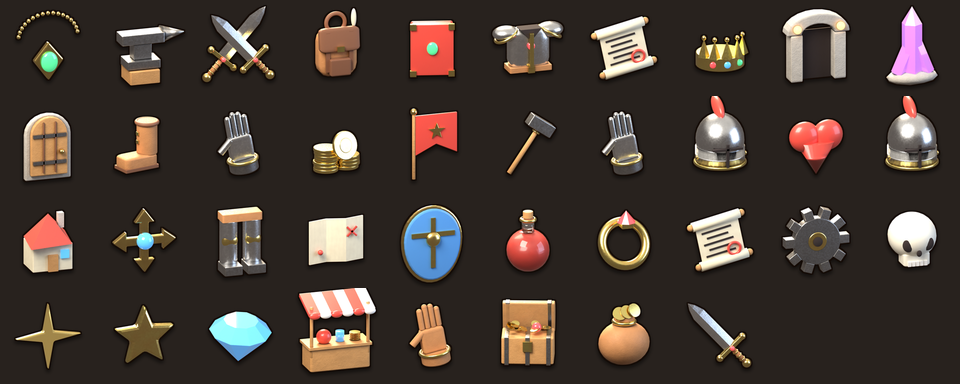
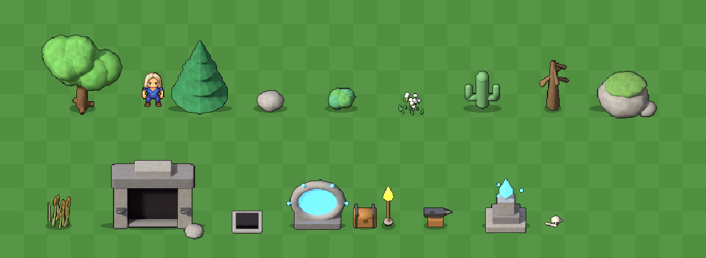
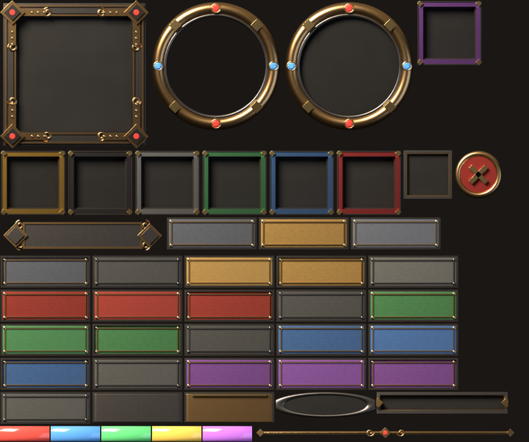
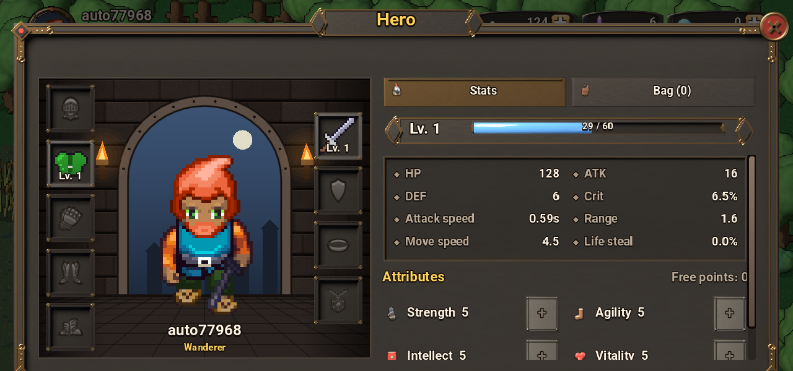
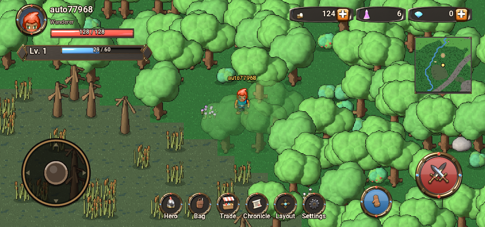

# ساخت گرافیک با Blender

<p></p>

تمام آیکون‌های رابط کاربری و اشیای جهان (درخت، سنگ، مشعل، سندان، صندوق،
ورودی سیاه‌چال و...) **با کد در Blender** ساخته و رندر می‌شوند و روی
**سرور اصلی** قرار می‌گیرند. کلاینت آن‌ها را از سرور دانلود می‌کند. برای
عوض‌کردن گرافیک فقط اسکریپت دوباره اجرا و سرور به‌روز می‌شود؛ کلاینت نیاز
به نسخه‌ی جدید ندارد.

```bash
pip install bpy==5.0.1 pillow   # خود Blender به‌صورت ماژول پایتون، بدون صفحه‌نمایش
tools/blender/build.sh          # حدود ۲ تا ۳ دقیقه روی CPU
```

| فایل | کار |
|---|---|
| `tools/blender/common.py` | صحنه، نورپردازی ثابت، دوربین، متریال‌ها و ابزارهای مدل‌سازی |
| `tools/blender/props.py` | ۱۷ شیء جهان با چند نسخه‌ی مختلف (مجموعاً ۳۲ اسپرایت) |
| `tools/blender/pixelate.py` | تبدیل رندر سه‌بعدی به پیکسل‌آرت و ساخت یک اطلس |
| `tools/blender/icons.py` | ۳۸ آیکون سه‌بعدی رابط کاربری |
| `tools/blender/gui.py` | کیت رابط کاربری: قاب پنجره، دکمه‌ها، اسلات‌ها، نوارها، تب‌ها و حلقه‌ها (۴۷ قطعه) |
| `tools/blender/pack.py` | انتشار در `assets/pack` با نام‌های دارای هش و `manifest.json` |
| `tools/blender/preview.py` | تصویر مقایسه‌ی اندازه‌ی اشیا کنار کاراکتر |

## آنچه از بازی‌های معروف گرفته شد

* **Dead Cells** (Motion Twin): همه‌چیز اول سه‌بعدی مدل می‌شد و بعد با
  یک ابزار داخلی به پیکسل‌آرت تبدیل می‌شد، تا بتوان سریع تغییر داد و
  دوباره استفاده کرد
  ([Game Developer](https://www.gamedeveloper.com/production/art-design-deep-dive-using-a-3d-pipeline-for-2d-animation-in-i-dead-cells-i-)،
  [80.lv](https://80.lv/articles/interview-with-the-developers-of-dead-cells)).
  `pixelate.py` همین کار را می‌کند: رندر با ۴ برابر وضوح، کوچک‌کردن،
  لبه‌ی سخت، پالت محدود و خط دور ۱ پیکسلی مثل هنر LPC، و یک سایه‌ی بیضی
  زیر هر شیء.
* **Stardew Valley**: نسبت اندازه‌ها بر پایه‌ی واحد تایل است. کاراکتر دو
  تایل قد دارد و درخت‌ها و اشیای بزرگ چند تایل
  ([انجمن Stardew](https://forums.stardewvalley.net/threads/sprite-sizes-character-sheets-pixel-art.5597/)).
  در این بازی تایل ۳۲ پیکسل است و قهرمان LPC حدود ۱٫۵ تایل. پیش‌تر
  درخت‌ها فقط یک تایل بودند و کاراکتر از محیط بزرگ‌تر دیده می‌شد. حالا
  درخت بلوط حدود ۳ تایل و کاج ۳ تایل ارتفاع دارند و همه‌ی اشیا با **یک
  مقیاس مشترک** ساخته می‌شوند.
* **آیکون‌های سه‌بعدی بازی‌های موبایل**: نور همه‌ی آیکون‌ها از **یک جهت
  ثابت** (بالا-چپ)، نورهای سطحی نرم به‌جای نقطه‌ای، و **خط تیره‌ی دور و
  سایه** تا روی هر پس‌زمینه‌ای خوانا باشند
  ([Medium: game icons from 3D](https://medium.com/@tatiananaji/how-to-create-game-icons-and-bundles-from-scratch-or-based-on-3d-model-48050dedba0f)،
  [Vagon](https://vagon.io/blog/how-to-turn-2d-icons-into-3d-renders-in-blender)).
* **محوشدن اشیای جلوی بازیکن**: وقتی قهرمان پشت تاج درخت می‌رود، آن درخت
  نیمه‌شفاف می‌شود (مثل سقف خانه‌ها در بازی‌های از بالا). این کار با
  «کاشی جایگزین» نیمه‌شفاف در Godot انجام می‌شود.

<p></p>

## کیت رابط کاربری (GUI kit)

<p></p>

با الهام از نمونه‌هایی که فرستادید (Aion، Metin2، GUI Kit «The Stone» و
رابط بازی‌های MMO چینی)، سبک رابط کاربری تیره و فلزی شد: **قاب آهنی کنده‌کاری‌شده
با براکت‌ها و نقش‌های برنزی در گوشه‌ها**، پنل‌های سنگی فرورفته، **دکمه‌های
فلزی حکاکی‌شده** در شش رنگ و چهار حالت (عادی، hover، فشرده، غیرفعال)،
**اسلات‌ها با قاب رنگ کمیابی**، **نوارهای شیشه‌ای** (مثل نوارهای Metin2)،
پلاک فلزی برای عنوان و سطح، تب‌ها، **حلقه‌ی برنزی گوهرنشان** برای پرتره،
منو و دکمه‌ی حمله، دکمه‌ی بستن و خط جداکننده‌ی تزئینی.

* همه‌ی قطعه‌ها مدل سه‌بعدی واقعی هستند (فلز، برنز، سنگ، گوهر) با همان
  نورپردازی، و با **۲ برابر وضوح** رندر می‌شوند.
* در یک اطلس (`gui.png`) بسته‌بندی می‌شوند و حاشیه‌ی **9-slice** هر قطعه
  در manifest می‌آید. کلاینت با `NineBox` (یک StyleBox سفارشی) گوشه‌ها را
  با نصف اندازه‌ی بافت می‌کشد و فقط وسط کش می‌آید. پس هر اندازه‌ای
  می‌گیرد و روی گوشی تیز می‌ماند.
* بازی قبل از ساخت اولین صفحه تا چند ثانیه صبر می‌کند تا کیت از سرور
  برسد. اگر نرسد، ظاهری که با کد رسم می‌شود (FancyBox) استفاده می‌شود.

<p></p>

## قاب‌بندی خودکار

هر شیء با همان مقیاس جهان ساخته می‌شود. بعد رأس‌هایش از دید دوربین
(ارتوگرافیک، ۴۵ درجه) تصویر می‌شوند و اندازه‌ی بوم به تایل کامل گرد
می‌شود. پس هیچ شیئی بریده نمی‌شود و فضای خالی هم هدر نمی‌رود. در
`props.json` برای هر اسپرایت نوشته می‌شود کدام تایلِ آن «خانه‌ی خود شیء»
است. کلاینت با `texture_origin` اسپرایت را روی همان خانه می‌گذارد. برخورد و
تعامل مثل قبل فقط روی همان یک خانه است و مرتب‌سازی عمق (y-sort) از پایه‌ی
شیء انجام می‌شود.

## تحویل از سرور

* sprite-service پوشه‌ی `assets/pack` را روی `/api/v1/sprites/pack/`
  سرو می‌کند (`SPRITE_PACK_DIR`).
* همه‌ی فایل‌ها به‌جز `manifest.json` هش محتوا را در نامشان دارند و با
  `Cache-Control: immutable` برای یک سال کش می‌شوند. فقط manifest (کش
  ۶۰ ثانیه‌ای) دوباره بررسی می‌شود.
* کلاینت (`autoload/pack.gd`) manifest را می‌خواند، اطلس اشیا را برای
  نقشه و هر آیکون را هنگام نیاز دانلود می‌کند (با mipmap برای اندازه‌های
  کوچک).
* اگر سرور در دسترس نباشد، بازی با گرافیک داخلی کار می‌کند (آیکون‌های SVG
  و اشیای رویه‌ای). اگر pack دیرتر برسد، نقشه خودش دوباره رسم می‌شود.

<p></p>

## افزودن یا تغییر یک آیکون یا شیء

1. یک تابع مدل در `icons.py` (نام تابع همان نام آیکون در کلاینت است) یا
   در `props.py` (و ردیف آن در `PROPS`) بنویسید یا تغییر دهید.
2. `tools/blender/build.sh` را اجرا کنید و `assets/pack` را کامیت یا روی
   سرور منتشر کنید.
3. کلاینت‌ها در بار بعدی بازکردن بازی نسخه‌ی جدید را می‌گیرند.
