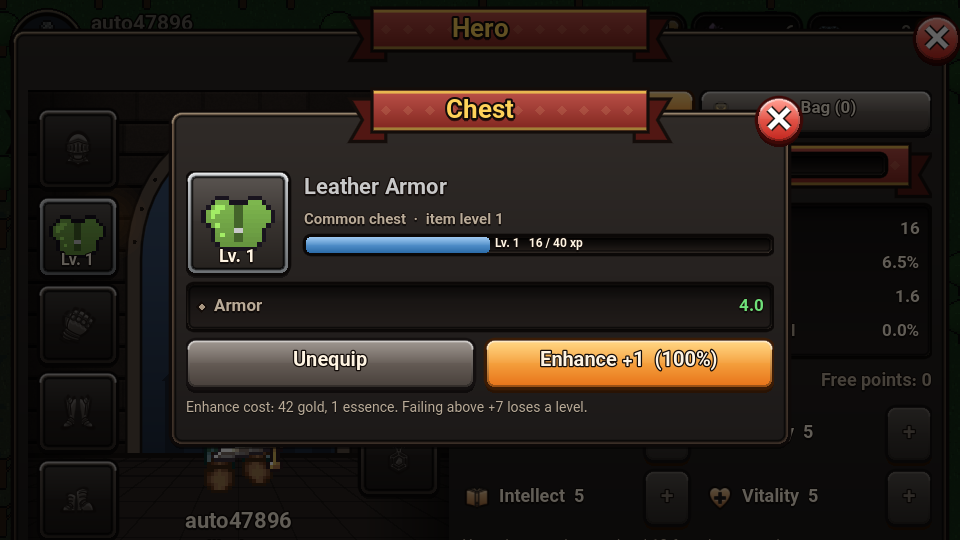
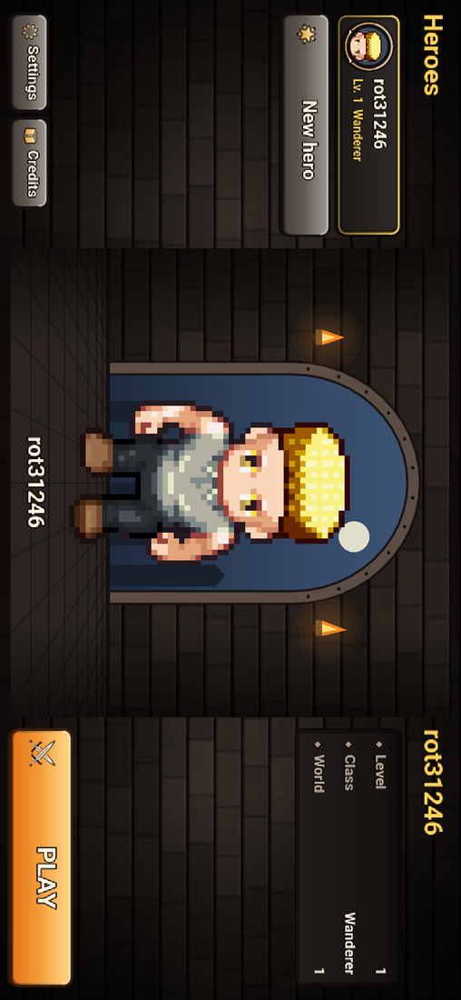
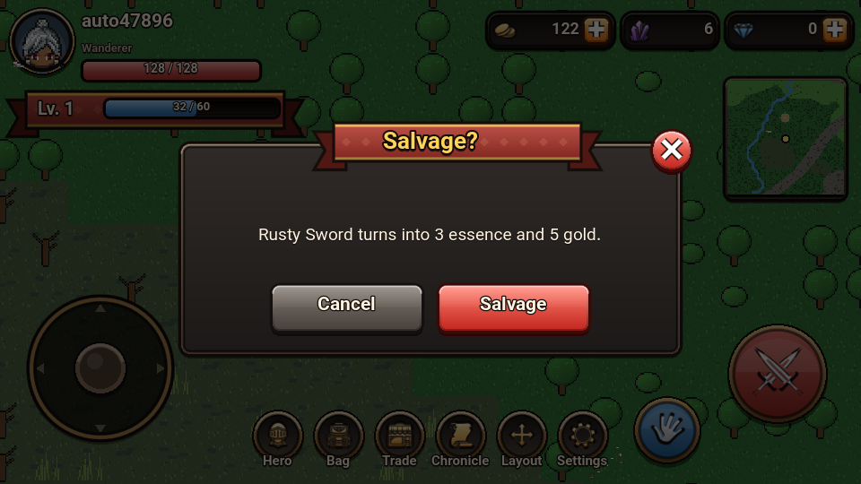
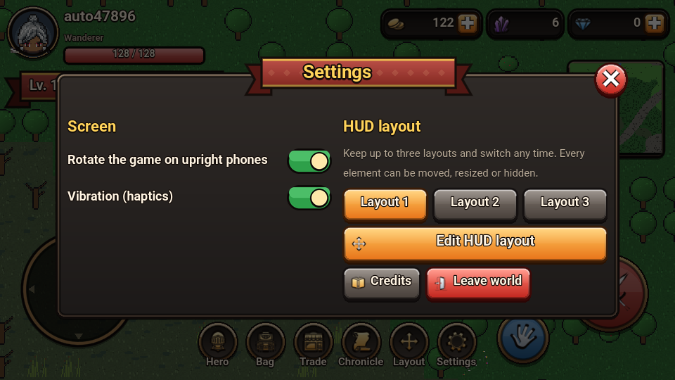
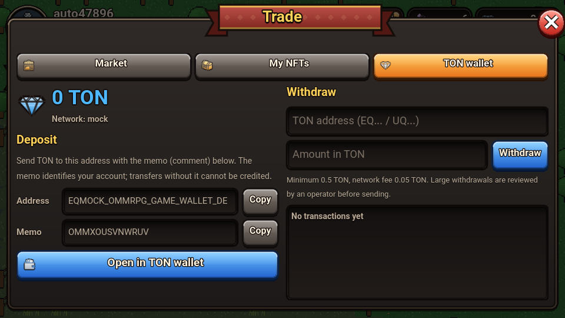

# Godot client

Godot **4.4**, GDScript, GL Compatibility renderer, exported to the **Web**
(no threads, so no special COOP/COEP headers) and opened full-screen inside
Telegram as a Mini App. It also runs on desktop for development.

## Structure

```
client/
  project.godot, export_presets.cfg (Web preset with Telegram bootstrap)
  autoload/
    config.gd      API/WS endpoints, dev/autotest/--rotate flags, screenshots
    telegram.gd    Telegram.WebApp bridge (see below)
    api.gd         async REST client
    realtime.gd    Centrifugo JSON-protocol client (connect, ping/pong, subscribe, awaitable RPC, reconnect)
    sprites.gd     texture loader/cache + sprite-service URLs and sheet layout
    game_state.gd  session, character, wallet, TON balance, vitals, toasts
    hud_layout.gd  customisable HUD: 3 saved layouts (local + server)
    settings.gd    device preferences (auto-rotate, haptics)
    popups.gd      window stack, dialogs, native money confirmations, toasts
  scenes/
    main.gd                screens, landscape canvas, rotated mode
    login.gd, character_select.gd
    world/...              zones, map, characters, monsters, effects
    ui/kit/                the UI kit: FancyBox, UiIcon, ItemSlot, Medallion, Ribbon, Portrait, Stage
    ui/ui_kit.gd           palette, theme, factories (buttons, panels, bars, pills, badges)
    ui/modal.gd            window frame (ribbon title, close button)
    ui/hud.gd              HUD + layout editor
    ui/touch_controls.gd   multi-touch joystick and action buttons
    ui/hero_panel.gd, trade_panel.gd, settings_panel.gd, history_panel.gd, credits_panel.gd
  assets/icons/            game-icons.net SVGs (CC BY 3.0, see SOURCES.txt)
  assets/ui/               stone textures and switches (tools/uiart.py)
```

Everything is built in code (a single `main.tscn`), so there are no
fragile scene files to keep in sync.

## Look and feel

<p></p>

A dark dungeon-stone style with bronze rims, glossy coloured buttons,
chunky outlined text, rarity-framed item slots with "Lv. N" badges, a red
ribbon for titles and the level bar, round medallion buttons with red "!"
badges, and currency pills with an orange "+".

* **Drawn in code, not stretched bitmaps.** `FancyBox` is a custom
  `StyleBox` that draws each frame from anti-aliased polygons: drop
  shadow, dark outline, a metallic rim with a vertical gradient and a lit
  top edge, and a gradient fill with gloss or an inner shadow. It renders
  at the phone's real resolution, so the UI is sharp on every screen and
  the theme (buttons, panels, inputs, bars, popup menus, scroll bars) uses
  it everywhere.
* **Icons** are white game-icons.net silhouettes (imported from SVG at
  128 px with mipmaps) recoloured by `ui_icon.gdshader`: a gradient fill,
  a dark outline and a soft shadow, with palettes such as gold, silver, TON
  blue and rarity colours.
* **Screens**: login, a landscape character select (roster, a stage with
  the hero, play or create), the HUD, the Hero screen (paper doll in front
  of a stone arch with torches: 9 equipment slots, level ribbon, stats,
  attributes and bag, item cards with equip / enhance / salvage), Trade
  (market with filters, NFT vault, TON wallet), Chronicle, Settings and
  Credits.

<p>


</p>

## Landscape and full screen

* The game is **always landscape**: the canvas is 960x540 and wider
  phones get more width (`canvas_items` / `expand` stretch). Camera zoom
  keeps about 12 tiles across the short side in half steps.
* In Telegram (Bot API 8.0+) the game calls `requestFullscreen()` at
  once, from the page head, before Godot has even loaded, and again from
  `telegram.gd`. Once the phone is sideways it calls `lockOrientation()`
  so it does not flip back.
* If the phone stays upright (for example with rotation lock on), the
  whole game is drawn **rotated by 90°** inside a `SubViewport` at the
  phone's full resolution. Touches are mapped through the rotation, and
  the Telegram safe-area insets are rotated too, so everything keeps
  working. This can be turned off in Settings; `--rotate` or `?rotate=1`
  forces it for testing.

<p></p>

## Telegram integration

`telegram.gd` (all calls are no-ops outside Telegram):

| feature | Mini App API |
|---|---|
| full screen and orientation | `requestFullscreen`, `exitFullscreen`, `lockOrientation`, `unlockOrientation`, `fullscreenChanged` / `fullscreenFailed` |
| safe areas | `safeAreaInset` + `contentSafeAreaInset` (notch and Telegram's own buttons), converted to canvas units |
| Back button | shown while a window is open; closes the top window (`BackButton`) |
| Settings button | opens the game settings (`SettingsButton`) |
| closing | `enableClosingConfirmation` while in the world, `disableVerticalSwipes` always |
| popups | `showPopup` for real-money confirmations (buying for TON, withdrawing): a native dialog that page content cannot fake |
| feedback | `HapticFeedback` (impact on buttons, selection on tabs, success / error on results), can be turned off |
| other | `addToHomeScreen` / `checkHomeScreenStatus`, `openLink` / `openTelegramLink`, header, background and bottom bar colours |

Login uses `initData` (verified by the gateway with the bot token). Set the
Mini App URL of your bot (BotFather → your bot → Bot Settings → Configure
Mini App) to your HTTPS domain that serves `deploy/nginx`.

## Windows and popups

`Popups` owns every window: they stack, the Telegram Back button and
Escape close the top one, tapping outside closes it, and toasts show above
windows. `await Popups.confirm(...)` gives an in-game dialog, and
`await Popups.money_confirm(...)` gives Telegram's native popup (with the
in-game dialog as a fallback outside Telegram).

<p>


</p>

## Controls

| action | touch | keyboard |
|---|---|---|
| move | joystick, or tap the ground (A* walk) | WASD / arrows |
| attack | ATK (hold to repeat), or tap a monster | Space |
| use (entrance, stairs, exit, chest, anvil, shrine) | USE (glows when something is near) | E |
| hero / bag / trade | menu, or tap the portrait for the hero | C / I / T |
| close a window | Telegram Back button, the red X or tap outside | Esc |

The joystick and action buttons read raw touch events, so moving and
attacking at the same time works.

## Trade (NFTs, market, TON)

Menu → **Trade** opens three tabs:

* **Market**: listings filtered by currency (TON or gold), rarity, slot and
  sort, or only your own. Buying for TON is confirmed with Telegram's
  native popup, buying for gold with an in-game dialog.
* **My NFTs**: tokens on OMM Chain with their state; claim to the current
  hero, send back to the vault, unmint, or list for sale (the currencies
  offered follow the market policy for the item's rarity). Eligible bag
  items can be minted here.
* **TON wallet**: balance, the game deposit address and the account memo
  (copy buttons and an "Open in TON wallet" link), withdrawals (native
  confirmation) with their status and the ledger. The TON balance is also a
  pill in the HUD; its "+" opens this tab.

Deposits, withdrawal status changes and sales arrive on the personal
channel as toasts, refresh the open panel and put a "!" badge on the
Trade button (new loot puts one on Bag).

<p> </p>

## Customisable HUD

Menu → **Layout** (or Settings → Edit HUD layout) enters edit mode. Every
HUD element can be arranged:

| element | |
|---|---|
| Portrait & health | avatar, name, class and the HP bar |
| Level & XP | the red level ribbon with the experience bar |
| Currencies | gold, essence and TON pills |
| Minimap, Menu, Joystick, Attack, Use, Target, Messages | |

* **Drag** an element to move it. With **Snap** on it snaps to the screen
  edges and centre lines and to the edges and centres of other elements,
  with blue alignment guides.
* **Resize** with the gold corner handle or with **- / +** (50% to 200%).
* **Hide/Show** any element; **Row/Column** turns the menu vertical or
  horizontal.
* **Three layouts**: keep, for example, one for fighting and one for
  trading, and switch in the editor or in Settings.
* **Save** stores the layouts on the device and on the account
  (`PUT /api/v1/settings/hud`), so they follow the player to other devices.
  **Cancel** discards the changes and **Reset** restores the defaults.
  **Move bar** moves the editor toolbar out of the way.

Positions are stored as fractions of the safe area, so a layout adapts to
any screen size.


## Building

```
# once: install Godot 4.4.1 and its export templates
godot --headless --path client --import
godot --headless --path client --export-release "Web" build/web/index.html
```

`deploy/docker-compose.yml` serves `client/build/web` with nginx.

## Testing

The client has an autotest mode that logs in, creates a character, walks to
a monster (A*), kills it and opens the panels:

```
# desktop/headless against a local stack (scripts/run-local.sh)
godot --headless --path client -- --autotest --dev-user=tester \
  --api=http://localhost:8080 --ws=ws://localhost:8000/connection/websocket

# with screenshots of every screen (needs a display, e.g. xvfb-run)
xvfb-run godot --path client --resolution 960x540 -- --autotest --dev-user=t --shots=/tmp/shots ...
# the same on an upright phone: the game is drawn rotated
xvfb-run godot --path client --resolution 540x960 -- --autotest --rotate --dev-user=t --shots=/tmp/shots ...

# the exported web build in Chromium (Playwright), upright phone viewport + touch
# (rotated mode), including touch drags in the layout editor
go run ./backend/tools/devserver -web client/build/web -addr :8099
node scripts/web-smoke.mjs http://localhost:8099 /tmp/shots
```
