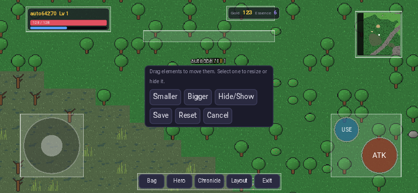

# Godot client

Godot **4.4**, GDScript, GL Compatibility renderer, exported to the **Web**
(no threads, so no special COOP/COEP headers) and opened full-screen inside
Telegram as a Mini App. It also runs on desktop for development.

## Structure

```
client/
  project.godot, export_presets.cfg (Web preset with Telegram bootstrap)
  autoload/
    config.gd      API/WS endpoints, dev/autotest flags, screenshots
    telegram.gd    Telegram.WebApp bridge: init data, full screen, safe areas, haptics
    api.gd         async REST client
    realtime.gd    Centrifugo JSON-protocol client (connect, ping/pong, subscribe, awaitable RPC, reconnect)
    sprites.gd     texture loader/cache + sprite-service URLs and sheet layout
    game_state.gd  session, character, wallet, vitals, toasts
    hud_layout.gd  customisable HUD layout (per orientation, local + server)
  scenes/
    main.gd                screen switching, orientation-aware canvas size
    login.gd               Telegram login (dev username login when allowed)
    character_select.gd    characters + creator with seeded random LPC looks
    world/world.gd         zones, chunk streaming, movement, combat, events
    world/map_view.gd      tile rendering + client-side collision
    world/lpc_sprite.gd    animated LPC character
    world/monster_node.gd  procedural monster
    ui/hud.gd              HUD + layout editor
    ui/touch_controls.gd   multi-touch joystick and buttons
    ui/inventory_panel.gd, character_panel.gd, history_panel.gd, modal.gd, ui_kit.gd
```

Everything is built in code (a single `main.tscn`), so there are no
fragile scene files to keep in sync.

## Telegram

* The Web preset's `head_include` loads `telegram-web-app.js` and, when
  launched from Telegram, calls `ready()`, `expand()`, `requestFullscreen()`
  (Bot API 8.0+) and `disableVerticalSwipes()`.
* `telegram.gd` reads `initData` for login (verified by the gateway with the
  bot token), listens to `safeAreaChanged`/`contentSafeAreaChanged` and
  converts the insets to canvas units so the HUD never sits under the notch
  or Telegram's buttons.
* Only the Mini App launcher is used. There is no bot chat UI.

Set the Mini App URL of your bot (BotFather → your bot → Bot Settings →
Configure Mini App) to your HTTPS domain that serves `deploy/nginx`.

## Responsive layout

* The base canvas is 540x960 in portrait and 960x540 in landscape (switched
  automatically) with `canvas_items`/`expand` stretch, so UI stays readable
  on any phone and extra space shows more of the world.
* Camera zoom keeps about 12 tiles across the shorter side, in half-step
  zooms to keep pixels crisp.

## Controls

| action | touch | keyboard |
|---|---|---|
| move | joystick, or tap the ground (A* walk) | WASD / arrows |
| attack | ATK (hold to repeat), or tap a monster | Space |
| use (entrance, stairs, exit, chest, anvil, shrine) | USE (glows when something is near) | E |
| bag / hero | menu | I / C |

The joystick and action buttons read raw touch events, so moving and
attacking at the same time works.

## Customisable HUD

Menu → **Layout** enters edit mode: drag any element (vitals, wallet,
minimap, menu, joystick, action buttons, message log), select one to make it
smaller/bigger or hide it, then **Save**. Positions are stored as fractions of
the safe area plus a scale, separately for portrait and landscape. They are
saved locally and in the account (`PUT /api/v1/settings/hud`), so the layout
follows the player across devices.



## Building

```
# once: install Godot 4.4.1 and its export templates
godot --headless --path client --import
godot --headless --path client --export-release "Web" build/web/index.html
```

`deploy/docker-compose.yml` serves `client/build/web` with nginx.

## Testing

The client has an autotest mode that logs in, creates a character, walks to
a monster (A*), kills it and opens the panels:

```
# desktop/headless against a local stack (scripts/run-local.sh)
godot --headless --path client -- --autotest --dev-user=tester \
  --api=http://localhost:8080 --ws=ws://localhost:8000/connection/websocket

# with screenshots (needs a display, e.g. xvfb-run)
xvfb-run godot --path client --resolution 540x960 -- --autotest --dev-user=t --shots=/tmp/shots ...

# the exported web build in Chromium (Playwright), mobile viewport + touch
go run ./backend/tools/devserver -web client/build/web -addr :8099
node scripts/web-smoke.mjs http://localhost:8099 /tmp/shots
```
