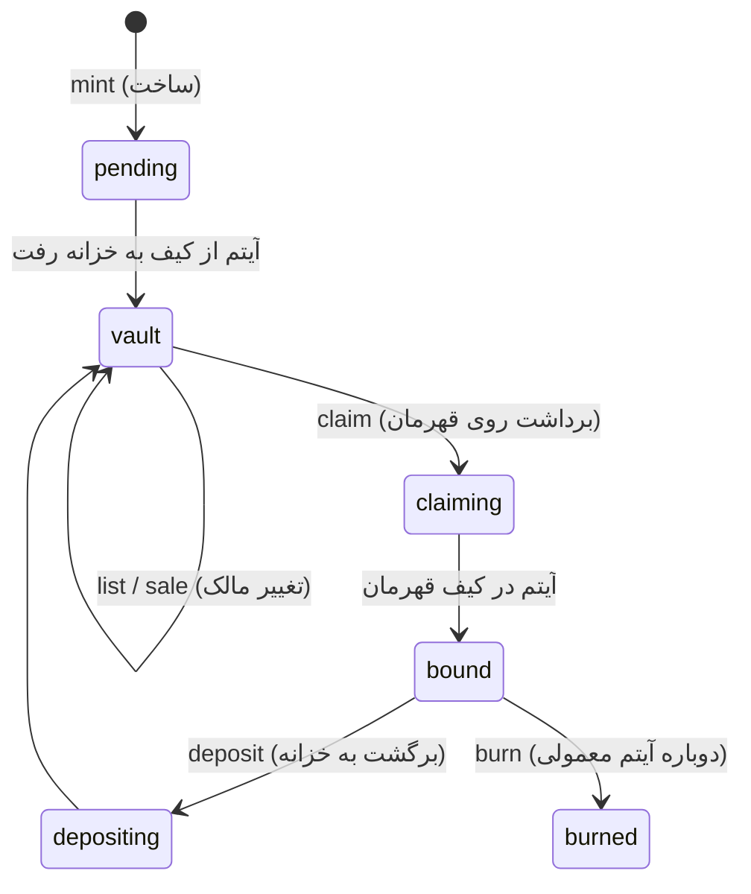

# NFT، زنجیره‌ی OMM، بازار و TON

بازیکن می‌تواند آیتم‌های باارزشش را به **NFT روی شبکه‌ی خود بازی (OMM
Chain)** تبدیل کند و در **بازار** با **TON** (پول واقعی) یا **طلا** (ارز
داخل بازی) بفروشد. اینکه چه چیزی با چه ارزی قابل معامله است را **سیاست
بازار** تعیین می‌کند که مدیر از پنل مدیریت تغییرش می‌دهد.

## سرویس‌ها

| سرویس | مسئولیت |
|---|---|
| `asset` | مالک NFTها، بازار، دفتر کل TON کاربران، تولید بلاک زنجیره‌ی OMM |
| `item` | خود آیتم‌ها؛ گام‌های idempotent: `vault`، `unvault`، `claim`، `snapshot`، `gold_transfer` |
| `ton` | تنها سرویسی که با شبکه‌ی TON حرف می‌زند: دیدن واریزها و ارسال برداشت‌ها |
| `gateway` | APIهای بازیکن زیر `/api/v1/vault`، `/market`، `/ton`، `/chain`، `/tokens` |

## چرخه‌ی عمر NFT

* فقط آیتم‌های **Rare یا بالاتر** (قابل تنظیم) NFT می‌شوند و آیتم نباید
  پوشیده باشد.
* در حالت `vault` آیتم از کیف قهرمان خارج شده و فقط در بازار قابل فروش
  است. با `claim` به کیف هر قهرمانِ همان حساب برمی‌گردد و قابل استفاده است.
* هر عملیات چند سرویسی یک **saga** است: asset-service ابتدا وضعیت میانی
  (`pending`/`claiming`/`depositing`) و یک `op_id` یکتا ثبت می‌کند، بعد
  گام item-service را صدا می‌زند که با همان `op_id` **idempotent** است، و
  در آخر وضعیت نهایی را ثبت می‌کند. اگر وسط کار چیزی قطع شود، **reconciler**
  (هر چند ثانیه) عملیات‌های نیمه‌کاره را با پرسیدن از item-service کامل یا
  برگشت می‌دهد. پس آیتم هیچ‌وقت دوتا نمی‌شود و گم هم نمی‌شود.

## بازار

| تنظیم (پیش‌فرض) | معنی |
|---|---|
| `mint_min_rarity` = rare | حداقل کمیابی برای NFT شدن |
| `gold_min_rarity` = rare | حداقل کمیابی برای فروش با طلا |
| `ton_min_rarity` = epic | حداقل کمیابی برای فروش با TON |
| `fee_bps` = 250 | کارمزد بازار ۲٫۵٪ |
| `min_price_ton` / `min_price_gold` | کف قیمت |
| `trading_enabled` / `withdraw_enabled` | کلید قطع اضطراری |

* **خرید با TON** کاملاً درون یک تراکنش PostgreSQL در asset-service است:
  کسر از خریدار، واریز به فروشنده منهای کارمزد، کارمزد به حساب خانه،
  انتقال مالکیت NFT و ثبت تراکنش زنجیره، همه با هم یا هیچ‌کدام.
* **خرید با طلا** یک saga است، چون طلا در کیف قهرمان‌ها در item-service
  نگه‌داری می‌شود: آگهی رزرو می‌شود (`settling`)، item-service طلا را
  منتقل می‌کند (کارمزد طلا **سوزانده** می‌شود تا تورم کنترل شود)، بعد مالکیت
  منتقل می‌شود.
* هر درخواست خرید `request_id` دارد، پس زدن دوباره‌ی دکمه دو بار خرید
  نمی‌کند. فروشنده پیام «فروخته شد» را آنی در بازی می‌بیند.

## کیف پول TON (امانی)

* موجودی کاربران به **nanoTON** در یک **دفتر کل (ledger)** نگه داشته
  می‌شود؛ هر تغییر یک ردیف با موجودی بعد از آن دارد.
* **واریز**: همه به یک آدرس کیف پول بازی واریز می‌کنند و در **comment**
  تراکنش، **memo** اختصاصی حساب (`OMM` + ۱۰ حرف) را می‌نویسند. ton-service
  تراکنش‌های ورودی را از آخرین cursor (در Dragonfly) می‌خواند و asset-service
  با کلید `tx_hash` به‌صورت idempotent موجودی را اضافه می‌کند.
* **برداشت**: مبلغ + کارمزد شبکه **قفل** می‌شود ← `pending` (یا اگر زیر
  سقف `auto_approve_max` باشد مستقیم `approved`) ← مدیر تأیید یا رد می‌کند
  ← ton-service می‌فرستد (`sending` ← `sent` یا `failed`). برداشت ناموفق
  **هرگز خودکار دوباره ارسال نمی‌شود** (خطر پرداخت دوباره)؛ مدیر بعد از
  بررسی روی شبکه تصمیم می‌گیرد. رد کردن، مبلغ قفل‌شده را برمی‌گرداند.
* حالت‌های `TON_MODE`: `mock` (شبیه‌سازی برای توسعه و تست)، `testnet`،
  `mainnet` (با tonutils-go و lite serverها، کیف پول V4R2 یا V5R1 از
  `TON_WALLET_SEED`).

> **هشدار**: حالت mainnet کامپایل و به‌صورت آفلاین (ساخت کیف پول از
> seed) تست شده، ولی در محیط توسعه دسترسی به شبکه‌ی TON نبود. قبل از
> استفاده با پول واقعی، روی testnet آزمایش کنید و فقط مقدار لازم برای
> عملیات روزانه را در کیف پول داغ نگه دارید.

## زنجیره‌ی OMM

زنجیره‌ی بازی یک **دفتر کل قابل راستی‌آزمایی** است، نه یک بلاک‌چین
عمومی: فقط سرور بازی بلاک تولید می‌کند، ولی هر کسی می‌تواند بررسی کند که
تاریخچه دست‌کاری نشده است.

* هر رویداد دارایی یک تراکنش است (`MINT`، `LIST`، `DELIST`، `SALE`،
  `BIND`، `VAULT`، `BURN`، `DEPOSIT`، `WITHDRAW`، ...) و **داخل همان
  تراکنش دیتابیس** رویداد اصلی ثبت می‌شود (پس زنجیره و وضعیت هیچ‌وقت از هم
  جدا نمی‌شوند).
* هر ۳ ثانیه تراکنش‌های معلق در یک بلاک مهر می‌شوند (با advisory lock،
  پس چند نمونه از سرویس هم‌زمان بلاک نمی‌سازند). هدر بلاک شامل هش بلاک
  قبلی و **ریشه‌ی Merkle** تراکنش‌هاست و با **ed25519** امضا می‌شود.
* هش برگ‌ها و گره‌های داخلی Merkle با پیشوند جدا ساخته می‌شوند (domain
  separation) تا نتوان یک گره را جای برگ جا زد.
* `GET /api/v1/chain` کلید عمومی را می‌دهد و `GET /api/v1/chain/tx/{hash}`
  **اثبات Merkle** تراکنش را. `GET /api/v1/tokens/{id}` تاریخچه‌ی کامل
  (provenance) یک NFT را برمی‌گرداند.

## ملاحظات حقوقی و پلتفرم

* **تلگرام**: طبق قوانین Mini Appها، کالای دیجیتال داخل برنامه باید با
  **Telegram Stars** فروخته شود. معامله‌ی بازیکن با بازیکن با TON و
  برداشت به کیف پول بیرونی ممکن است مشمول قوانین دیگری باشد. قبل از
  انتشار، قوانین فعلی تلگرام و App Store/Google Play را بررسی کنید.
* **مقررات مالی**: نگه‌داری امانی TON کاربران و امکان برداشت پول واقعی
  در بسیاری از کشورها الزامات **KYC/AML** و مجوز دارد. کلیدهای قطع
  اضطراری، تأیید دستی برداشت و گزارش ممیزی پنل مدیریت برای همین هستند،
  ولی جایگزین مشاوره‌ی حقوقی نیستند.
