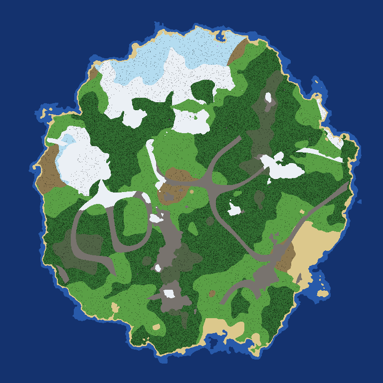
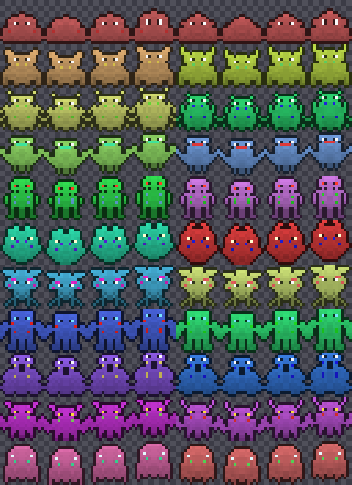
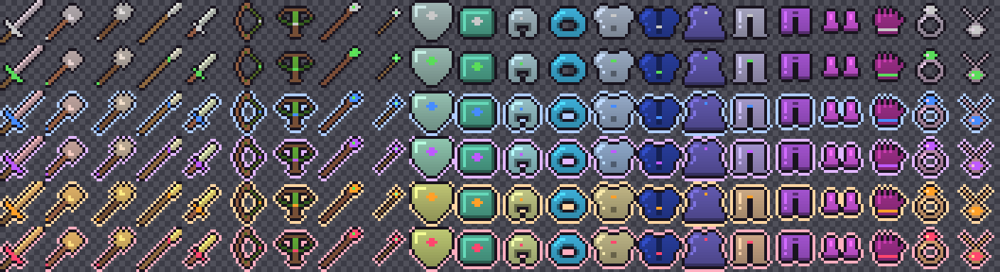

# Procedural generation: a world that builds itself from seeds

Everything in the world is a pure function of a seed. Only seeds (and the
things players *own* or *change*) are stored; terrain, creatures, dungeons,
names and art are regenerated identically by any service, on any machine.

## The primitive

`backend/pkg/seed` is the one randomness source:

* `seed.Derive(parent, parts...)`: carves an independent child seed out of a
  parent by hashing a path, for example `Derive(world, "chunk", cx, cy)`,
  `Derive(item, "affix", 2)`. Different paths never collide, and adding a new
  generator never shifts existing ones.
* `seed.New(s)`: a splitmix64 stream with `Float`, `Intn`, `Range`,
  `Weighted`, `Chance`, `Normal`, `Pick`, `Shuffle`.

`backend/pkg/noise` adds seeded Perlin noise and fBm for terrain.

## World (`pkg/game/world`)

A world is `{id, seed, size_chunks, name}`; a chunk is 32x32 tiles.

1. **Elevation**: 5-octave fBm with an island falloff, so the edges are ocean.
   Ridged noise draws long mountain ranges.
2. **Temperature**: low-frequency noise plus a north-to-south gradient, cooled
   by altitude.
3. **Moisture**: 4-octave fBm.
4. **Biome** from (elevation, temperature, moisture): ocean, beach, plains,
   forest, desert, tundra, swamp, mountain, taiga, volcanic.
5. **Props** (trees, pines, rocks, cacti, reeds...) from per-tile seeded rolls
   with biome densities, modulated by a cluster noise so forests clump.
6. **Starter plaza**: the walkable spot nearest the centre, with a shrine
   (respawn) and an anvil (upgrades). No monsters or entrances inside the
   safe radius.
7. **Danger** (`LevelAt`) grows with distance from the plaza.
8. **Dungeon entrances**: each chunk has a seeded 7% chance of one, with a
   generated name ("Crypt of Vraethor") and a tier from the local danger.

Preview any seed:

```
cd backend && go run ./tools/worldmap -seed 987 -chunks 24 -out world.png
```



## Species (`pkg/game/bestiary`)

Each world generates 44 species: 11 families x 4 variants (slime, beast,
insect, bird, undead, elemental, plant, golem, serpent, imp, spirit). Every
species rolls its own name ("Gloomvar Hound"), habitat biomes, HP/attack/
defense multipliers, speed, size, colours and a sprite seed. Chunk spawns
pick species living in the local biome, at the local danger level, with a
chance of elites.

## Items (`pkg/game/items`)

`Generate(seed, item_level, luck, min_rarity)` picks a base (24 bases over 9
slots: sword, axe, mace, spear, dagger, bow, crossbow, staff, wand, shield,
tome, helm, hood, plate, leather, robe, greaves, pants, boots, sabatons,
gauntlets, gloves, ring, amulet), a rarity (common → mythic, luck shifts the
weights), base damage/armor from item level and quality, and 0 to 5
non-repeating affixes (strength, crit, life steal, magic find...). Names come
from affixes ("Keen Sword of the Fox"). Legendary and mythic items get
generated proper names ("Vraethos, the Unbroken Sword"); mythics also get a
unique trait. Each base maps to a real LPC equipment layer, so equipped gear
changes how the character looks.

Loot seeds derive from the kill (`Derive(secret, "loot", zone, monster,
death-epoch)`), so a kill always yields the same drop and can never be
granted twice.

## Dungeons (`pkg/game/dungeon`)

Each entrance has a fixed layout seed, so players can learn a dungeon. Each
run is a separate instance with fresh monsters and chests. A floor is
generated by: non-overlapping rooms → a minimum spanning tree of L-shaped
corridors plus extra loops → BFS distances → stairs in the farthest room (or
the boss on the last floor) → exit next to the start → torches, bones,
monsters per room (the start room is safe) → 1 or 2 chests. Tier sets the
size, the number of floors (1 to 5) and the monster level. Tests assert that
every floor tile is reachable.

## Characters

* **Appearance**: `sprite.Catalog.RandomRecipe(seed, body)` dresses an LPC
  character: body type, skin, eyes, hair style and colour, beard, shirt,
  legs, shoes, all from the LPC catalog.
* **Hidden traits**: `progression.RollHidden(seed)` rolls the hidden Root
  (Starforged, Voidborn, Soul Weaver, Spirit Vessel, Beast Heart, or none),
  Talent and learning potential. They change attributes, XP gain, loot luck
  and enhancement odds. They are never sent to the client; players only see
  a vague omen.

## Names (`pkg/game/names`)

A syllable generator (onset + vowel + coda + ending) names worlds, species,
dungeons and legendary items.

## Art (`pkg/sprite`)

See [SPRITE_SERVICE.md](SPRITE_SERVICE.md): creatures, item icons and the
tileset are also drawn from seeds.



