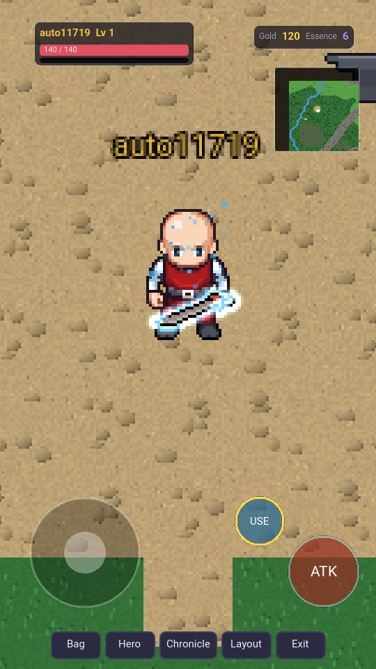

# افکت سلاح‌ها و عنصرها

## عنصرها (گیم‌پلی)

هر سلاح ممکن است یکی از شش عنصر را داشته باشد: **آتش، یخ، صاعقه، سم،
مقدس، سایه**. عنصر آخرین مرحله‌ی ساخت آیتم از seed است، پس آیتم‌های قدیمی
تغییر نمی‌کنند. احتمال آن با کمیابی بالا می‌رود:

| کمیابی | Common | Uncommon | Rare | Epic | Legendary | Mythic |
|---|---|---|---|---|---|---|
| احتمال عنصر | ۰ | ۱۲٪ | ۳۵٪ | ۶۰٪ | ۸۵٪ | ۱۰۰٪ |

* **آسیب عنصری** = `round((2 + 0.9 × item_level) × (0.8 + 0.15 × rarity) × تصادفی[0.85..1.15])`.
  این آسیب **بعد از زره** اضافه می‌شود (زره فیزیکی جلویش را نمی‌گیرد) و در
  ضربه‌ی کریتیکال ×۱.۵ می‌شود.
* **مقاومت خانواده‌ها**: مثلاً گیاه ×۱.۶ در برابر آتش، مرده‌ها ×۱.۸ در برابر
  مقدس ولی ×۰.۳ در برابر سم، گولم ×۰.۲ در برابر سم، ایمپ ×۰.۳ در برابر آتش.
* **هیولاهای عنصری** هم‌عنصر خود را تقریباً نادیده می‌گیرند (×۰.۲) و از
  عنصر مخالف ×۱.۸ آسیب می‌خورند (آتش↔یخ، مقدس↔سایه، صاعقه↔سم).
* شماره‌ی آسیب عنصری با رنگ عنصر روی صفحه نشان داده می‌شود.

## سطح افکت (FX tier)

سرور برای سلاح پوشیده‌شده یک `fx` می‌فرستد: `{element, tier, rarity}`.

| tier | شرط | ظاهر |
|---|---|---|
| ۱ | ارتقای +۵، یا هر سلاح عنصری یا لجندری | هاله‌ی ملایم دور تیغه (شدت ۰٫۸) |
| ۲ | +۱۰ | هاله‌ی پهن‌تر و قوی‌تر (۱٫۳) + ۱۰ ذره به رنگ عنصر |
| ۳ | +۱۵ | بیشترین درخشش (۱٫۹) + ۲۲ ذره |

سلاح بدون عنصر رنگ کمیابی‌اش را می‌درخشد.

## پیاده‌سازی نمایش

1. **ماسک سلاح**: سرویس اسپرایت هنگام ترکیب لایه‌های LPC ثبت می‌کند هر
   پیکسل از کدام لایه آمده. با `&mask=weapon` فقط پیکسل‌هایی که **سلاح
   در تصویر نهایی دیده می‌شود** برمی‌گردند (جاهایی که پشت بدن یا دست
   پنهان است حذف می‌شوند). پس هاله فقط دور بخش دیدنی تیغه است، در همه‌ی
   فریم‌های انیمیشن و همه‌ی جهت‌ها.
2. **شیدر Godot** (`client/assets/shaders/weapon_fx.gdshader`): ماسک را
   با blend افزایشی و یک شیدر glow رسم می‌کند. شش سبک مختلف (شعله‌ی رو به
   بالا برای آتش، کریستال برای یخ، جرقه‌ی تصادفی برای صاعقه، ...).
   `region` اسپرایت افکت با فریم انیمیشن کاراکتر همگام می‌شود.
3. **ذره‌ها**: از tier ۲ به بالا یک `CPUParticles2D` با رنگ عنصر اضافه
   می‌شود.
4. **آیکون‌ها**: آیکون آیتم‌های عنصری با `&element=` رنگ و درخشش عنصر را
   می‌گیرند.
